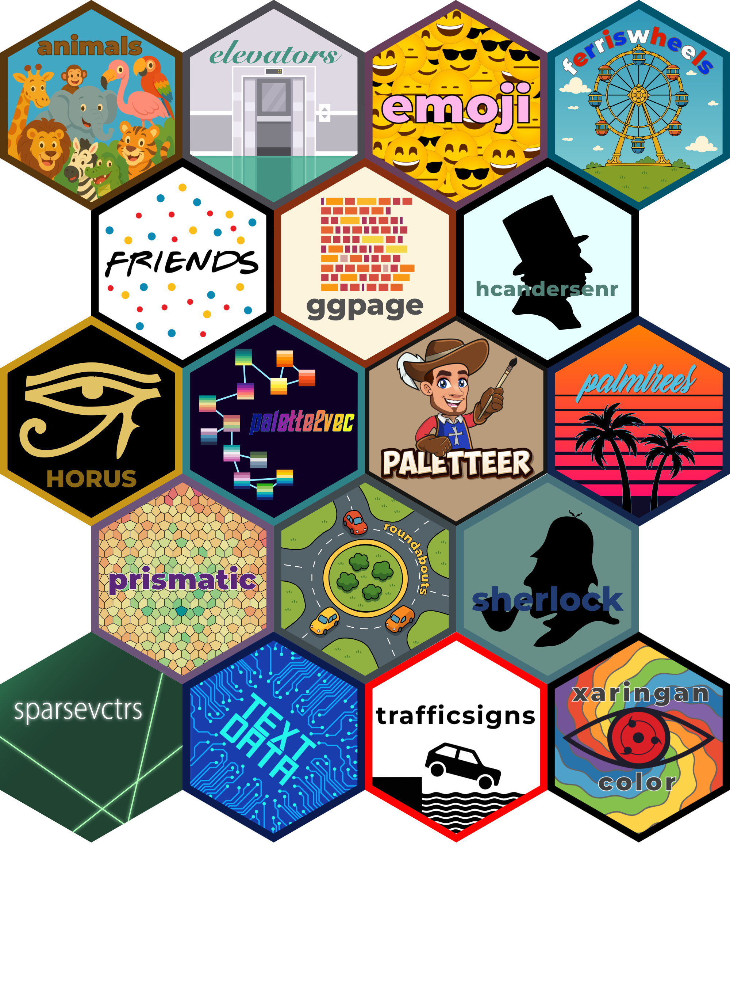
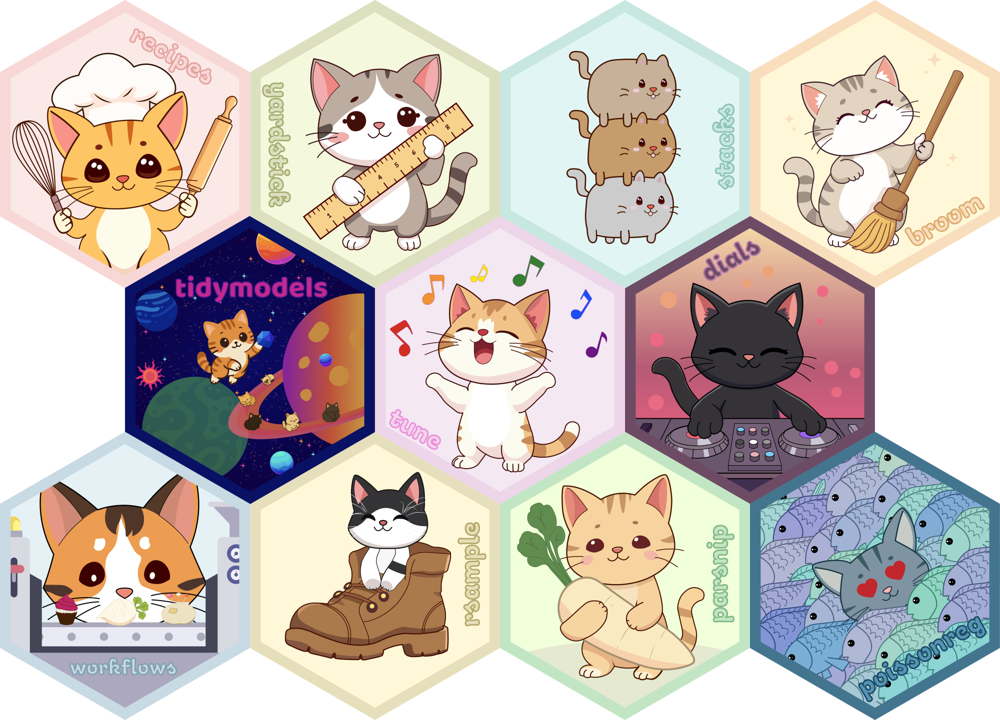

# hex-stickers

plot of chunk hexwall

All the hex logos as either [PNG](PNG/) or [SVG](SVG/).

All stickers are under with [CC0](LICENSE.md).

# Cat tidymodels

plot of chunk cat-hexwall

All the hex logos as either [PNG](cats/1x/) or [SVG](cats/SVG/).

All stickers are under with [CC0](LICENSE.md).
