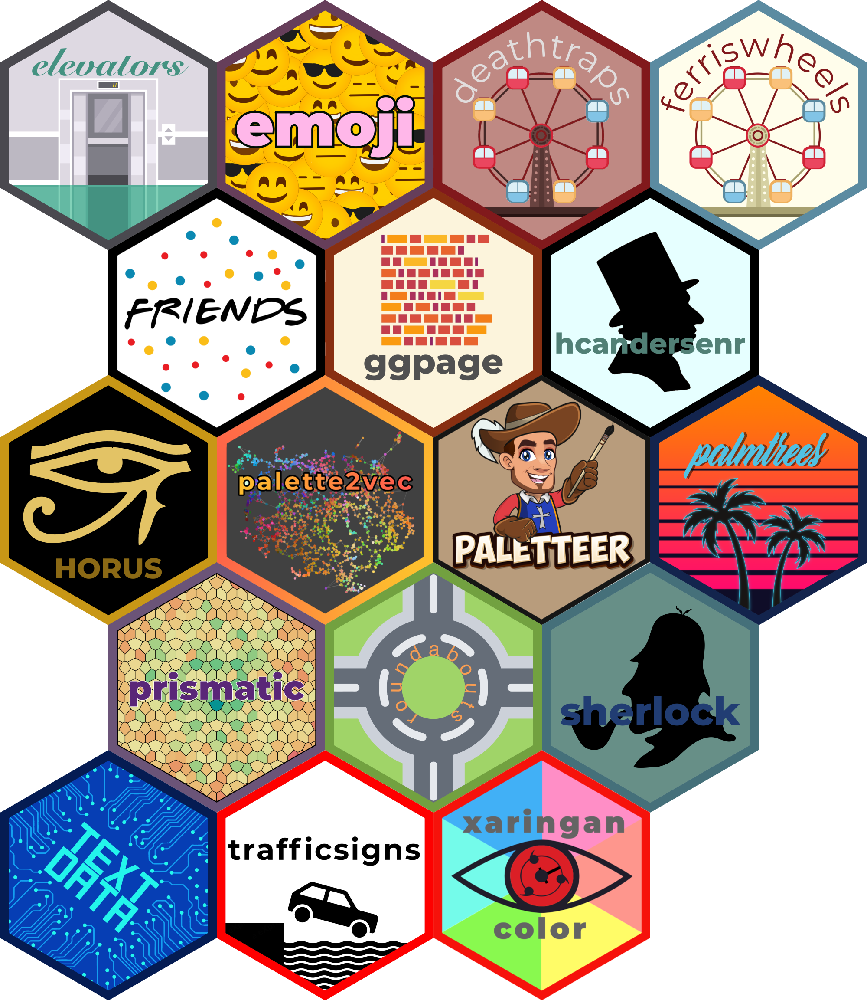

# hex-stickers

    ## Warning: `invoke()` was deprecated in purrr 1.0.0.
    ## ℹ Please use `exec()` instead.

All the hex logos as either [PNG](PNG/) or [SVG](SVG/).

All stickers are under with [CC0](LICENSE.md).
