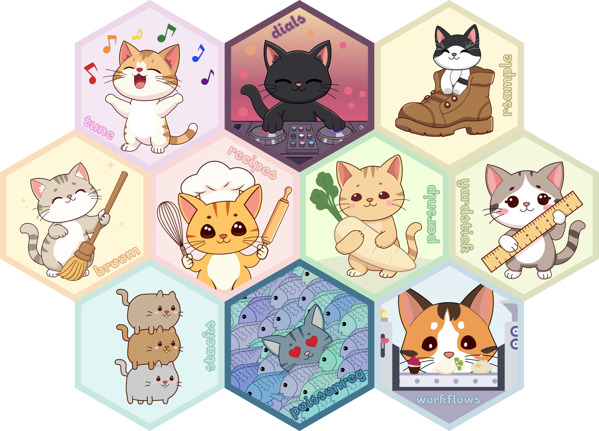

# hex-stickers

All the hex logos as either [PNG](PNG/) or [SVG](SVG/).

All stickers are under with [CC0](LICENSE.md).

# Cat tidymodels

    ## cats/1x/broom.png
    ## cats/1x/dials.png
    ## cats/1x/parsnip.png
    ## cats/1x/poissonreg.png
    ## cats/1x/recipes.png
    ## cats/1x/rsample.png
    ## cats/1x/stacks.png
    ## cats/1x/tune.png
    ## cats/1x/workflows.png
    ## cats/1x/yardstick.png

All the hex logos as either [PNG](cats/x1/) or [SVG](cats/SVG/).

All stickers are under with [CC0](LICENSE.md).
